# 💪 WorkoutApp - Application Mobile de Fitness

<p align="center">
  
</p>

<p align="center">
  <strong>Une application Android moderne pour découvrir et organiser vos exercices de fitness</strong>
</p>


## 📥 Télécharger l'application

Scannez le QR code ci-dessous pour télécharger l’APK :

<p align="center">
  
</p>

ou cliquez ici :

➡️ **[Télécharger l'APK](https://github.com/EyaRejeb/AndroidProjectEya/releases/download/v1.0/app-debug.apk)**

## 📱 Captures d'écran

### 🏠 Écran d'accueil (Home)
<p align="center">
  
  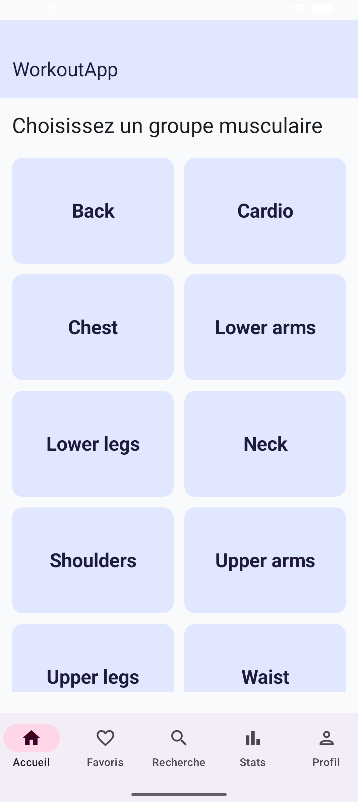
  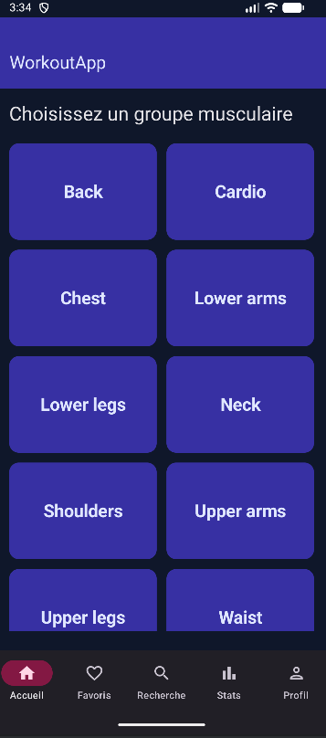
</p>

---

### 💪 Groupes musculaires
<p align="center">
  
</p>

---

### 📚 Liste d'exercices
<p align="center">
  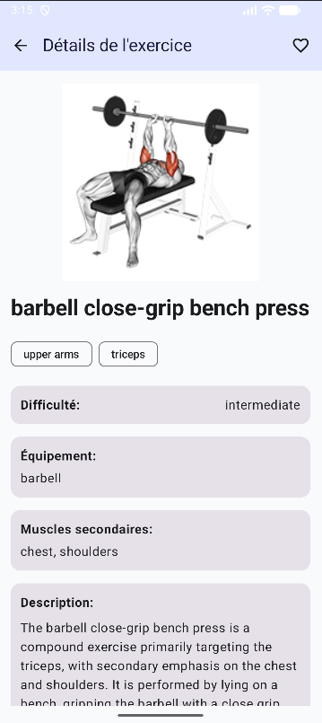
</p>

---

### 🔎 Détails de l'exercice
<p align="center">
  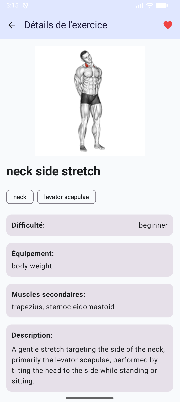
</p>

---

### ❤️ Page Favoris
<p align="center">
  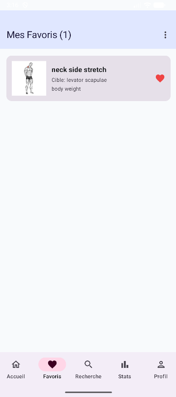
  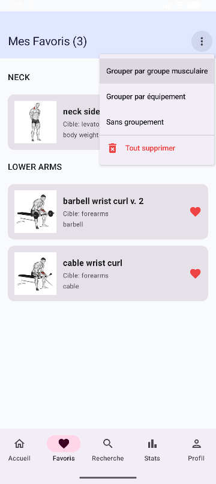
  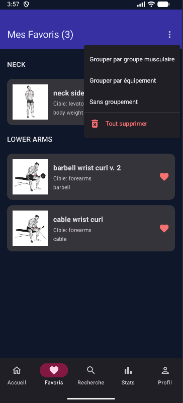
</p>

---

### 🔍 Recherche Avancée
<p align="center">
  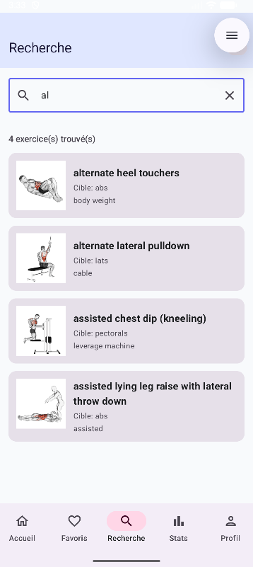
  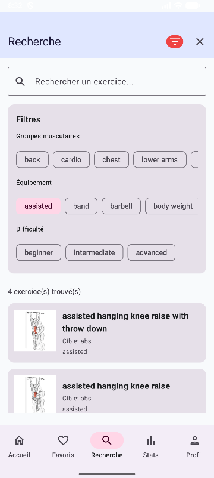
</p>

---

### 📊 Statistiques
<p align="center">
  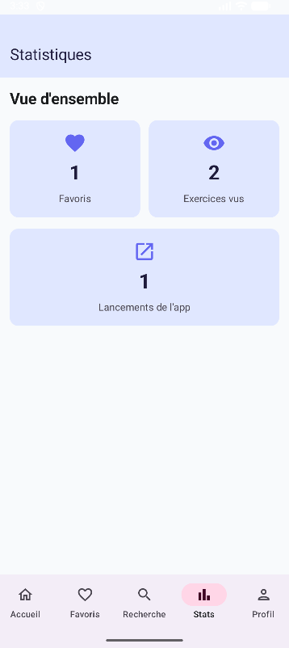
  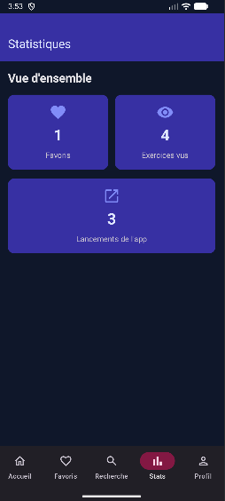
</p>

---

### ⚙️ Profil & Paramètres
<p align="center">
  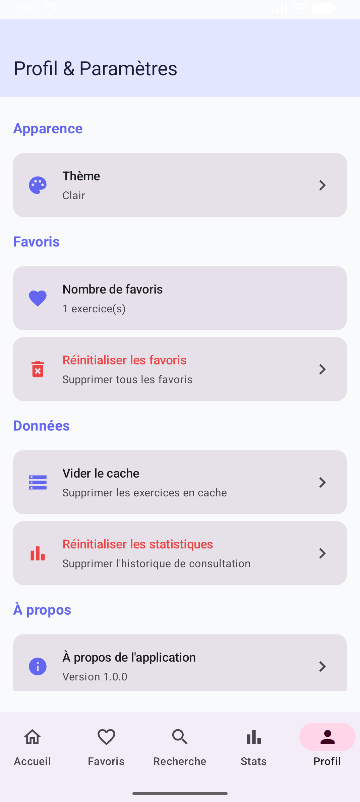
  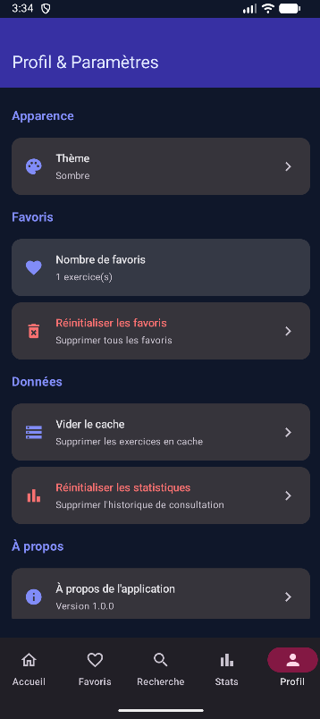
  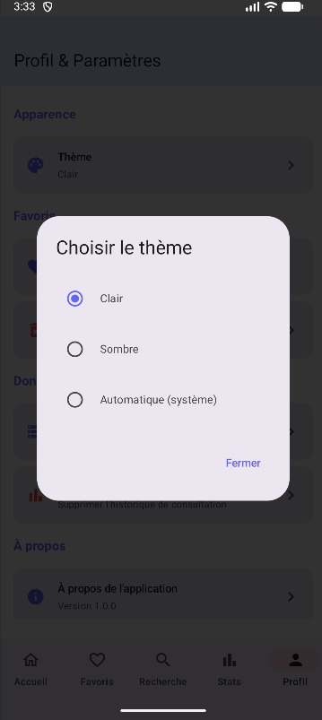
</p>

---

## 📋 Table des matières

- [Aperçu](#-aperçu)
- [Fonctionnalités](#-fonctionnalités)
- [Technologies utilisées](#-technologies-utilisées)
- [Architecture](#-architecture)
- [API Documentation](#-api-documentation)
- [Captures d'écran](#-captures-décran)
- [Installation](#-installation)
- [Structure du projet](#-structure-du-projet)
- [Contribuer](#-contribuer)

---

## 🎯 Aperçu

**WorkoutApp** est une application mobile Android native qui permet aux utilisateurs de découvrir plus de 1300 exercices de fitness, de les organiser en favoris, et de suivre leurs progrès. L'application utilise l'API ExerciseDB pour fournir des informations détaillées sur chaque exercice, incluant des animations GIF, des instructions étape par étape, et des informations sur les muscles ciblés.

### 🌟 Points forts

- ✨ **Interface moderne** avec Material Design 3
- 🌓 **Mode sombre/clair** adaptatif
- 📱 **Navigation intuitive** avec Bottom Navigation
- 💾 **Mode hors ligne** avec cache local
- ❤️ **Système de favoris** persistant
- 🔍 **Recherche avancée** avec filtres multiples
- 📊 **Statistiques** d'utilisation
- 🎨 **Animations fluides** et transitions élégantes

---

## 🚀 Fonctionnalités

### 🏠 Écran d'accueil
- **Liste des groupes musculaires** : Parcourir les exercices par catégorie (bras, jambes, dos, pectoraux, etc.)
- **Splash screen animé** au démarrage
- **Interface responsive** avec grille adaptative

### 📚 Liste d'exercices
- **Filtrage par groupe musculaire** : Affichage des exercices pertinents
- **Aperçu visuel** : Image GIF animée pour chaque exercice
- **Indicateur de favoris** : Visualisation rapide des exercices favoris
- **Chargement optimisé** : Pagination et cache local

### 🔎 Détails de l'exercice
- **Animation GIF** : Démonstration visuelle du mouvement
- **Instructions détaillées** : Guide étape par étape
- **Informations complètes** :
    - Groupe musculaire principal
    - Muscles secondaires ciblés
    - Équipement nécessaire
    - Niveau de difficulté (débutant, intermédiaire, avancé)
    - Catégorie (force, cardio, mobilité, etc.)
- **Ajout/Retrait des favoris** : Gestion facile avec icône cœur

### ❤️ Page Favoris
- **Liste personnalisée** : Tous vos exercices favoris en un seul endroit
- **Groupement flexible** :
    - Par groupe musculaire
    - Par équipement
    - Par difficulté
    - Sans groupement
- **Compteur en temps réel** : Nombre total de favoris
- **Actions en masse** : Supprimer tous les favoris
- **Accès hors ligne** : Consultation sans connexion Internet

### 🔍 Recherche Avancée
- **Recherche en temps réel** : Résultats instantanés pendant la saisie
- **Filtres multiples** :
    - **Groupes musculaires** : Sélection multiple
    - **Équipement** : body weight, barbell, dumbbell, etc.
    - **Niveau de difficulté** : débutant, intermédiaire, avancé
- **Compteur de résultats** : Nombre d'exercices trouvés
- **Effacement rapide** : Bouton pour réinitialiser tous les filtres

### 📊 Statistiques
- **Favoris** : Nombre total d'exercices favoris
- **Exercices consultés** : Compteur de vues
- **Lancements de l'app** : Suivi d'utilisation
- **Interface visuelle** : Cartes colorées avec icônes

### ⚙️ Profil & Paramètres
- **Apparence** :
    - Mode clair
    - Mode sombre
    - Automatique (suit le système)
- **Gestion des favoris** :
    - Compteur en temps réel
    - Réinitialisation complète
- **Gestion des données** :
    - Vider le cache
    - Réinitialiser les statistiques
- **À propos** :
    - Informations sur l'application
    - Version actuelle
    - Crédits et développeur

---

## 🛠️ Technologies utilisées

### Langage de programmation
- **Kotlin 2.1.0** : Langage moderne et concis pour Android
    - Coroutines pour la programmation asynchrone
    - Flow pour les streams de données réactifs
    - Extension functions pour un code plus lisible

### Interface utilisateur
- **Jetpack Compose 1.7.5** : Framework UI déclaratif moderne
    - Composants Material 3
    - Navigation Compose
    - State management avec StateFlow
    - Animations et transitions fluides

### Architecture & Design Pattern
- **MVVM (Model-View-ViewModel)** : Séparation claire des responsabilités
    - **Model** : Gestion des données (Repository, API, Database)
    - **View** : UI avec Jetpack Compose
    - **ViewModel** : Logique de présentation et états UI

### Networking
- **Ktor Client 3.0.2** : Client HTTP moderne et léger
    - Engine Android optimisé
    - Content Negotiation avec Kotlinx Serialization
    - Logging pour le débogage
    - Timeout configuration
    - Support HTTPS natif

### Base de données locale
- **Room 2.6.1** : Couche d'abstraction au-dessus de SQLite
    - DAO (Data Access Object) pattern
    - Type Converters pour les types complexes
    - Flow pour les queries réactives
    - Migration automatique avec fallbackToDestructiveMigration

### Stockage des préférences
- **DataStore Preferences 1.1.1** : Remplacement moderne de SharedPreferences
    - API basée sur Coroutines et Flow
    - Type-safe
    - Gestion asynchrone
    - Support des transactions

### Gestion d'images
- **Coil 3.0.4** : Bibliothèque de chargement d'images performante
    - Support des GIF animés
    - Cache mémoire et disque
    - Intégration Compose native
    - Placeholders et error handling

### Animations
- **Lottie Compose 6.4.0** : Animations vectorielles haute qualité
    - Animations JSON from After Effects
    - Performance optimale
    - Intégration Jetpack Compose

### Injection de dépendances
- **ViewModelFactory personnalisé** : Gestion manuelle des dépendances
    - Construction des ViewModels avec dépendances
    - SavedStateHandle pour la restauration d'état

### Compilation & Build
- **Kotlin Symbol Processing (KSP) 2.1.0** : Traitement des annotations
    - Plus rapide que KAPT
    - Utilisé par Room pour la génération de code
- **Gradle Kotlin DSL** : Configuration du build moderne
    - Type-safe
    - Auto-complétion dans l'IDE
    - Refactoring facile

---

## 🏗️ Architecture

L'application suit une architecture **MVVM (Model-View-ViewModel)** stricte avec une séparation claire en 3 couches :

### 📊 Diagramme de l'architecture

```
┌─────────────────────────────────────────────────────────┐
│                    PRESENTATION LAYER                    │
│  ┌────────────────────┐      ┌────────────────────┐    │
│  │   UI (Compose)     │ ───> │   ViewModels       │    │
│  │  - Screens         │      │  - StateFlow       │    │
│  │  - Components      │      │  - UI States       │    │
│  │  - Navigation      │      │  - Events          │    │
│  └────────────────────┘      └────────────────────┘    │
└─────────────────────────────────────────────────────────┘
                           │
                           ▼
┌─────────────────────────────────────────────────────────┐
│                     DOMAIN LAYER                         │
│  ┌────────────────────┐      ┌────────────────────┐    │
│  │   Models           │      │   Use Cases        │    │
│  │  - Exercise        │      │  (Business Logic)  │    │
│  │  - Data Classes    │      │                    │    │
│  └────────────────────┘      └────────────────────┘    │
└─────────────────────────────────────────────────────────┘
                           │
                           ▼
┌─────────────────────────────────────────────────────────┐
│                      DATA LAYER                          │
│  ┌─────────────┐  ┌──────────────┐  ┌──────────────┐  │
│  │ Repository  │  │  API Service │  │  Database    │  │
│  │  - Logic    │  │  - Ktor      │  │  - Room      │  │
│  │  - Cache    │  │  - DTOs      │  │  - Entities  │  │
│  └─────────────┘  └──────────────┘  └──────────────┘  │
│         │                 │                  │          │
│         └─────────────────┴──────────────────┘          │
│                   Data Sources                          │
└─────────────────────────────────────────────────────────┘
```

### 🔄 Flux de données

```
User Action
    ↓
View (Composable)
    ↓
ViewModel (StateFlow)
    ↓
Repository
    ↓
Data Source (API / Database)
    ↓
ViewModel (update State)
    ↓
View (recompose)
```

### 📁 Couches détaillées

#### **1. Presentation Layer**
- **Views (Composables)** :
    - Écrans avec `@Composable`
    - Observent les `StateFlow` des ViewModels
    - Déclarent l'UI de manière déclarative
    - Gèrent les événements utilisateur

- **ViewModels** :
    - Exposent des `StateFlow<UiState>`
    - Contiennent la logique de présentation
    - Communiquent avec les Repositories
    - Survivent aux changements de configuration

#### **2. Domain Layer**
- **Models** :
    - Classes de données Kotlin (`data class`)
    - Représentent les entités métier
    - Indépendants de la couche Data

- **Use Cases** (optionnel) :
    - Encapsulent la logique métier complexe
    - Réutilisables
    - Testables unitairement

#### **3. Data Layer**
- **Repository** :
    - Interface unique pour accéder aux données
    - Gère la logique de cache
    - Combine plusieurs sources de données
    - Pattern "single source of truth"

- **Data Sources** :
    - **Remote** : API avec Ktor
    - **Local** : Base de données Room
    - **Preferences** : DataStore

### 🎯 Avantages de cette architecture

✅ **Séparation des responsabilités** : Chaque couche a un rôle clair
✅ **Testabilité** : Facile de mocker les dépendances
✅ **Maintenabilité** : Code organisé et structuré
✅ **Scalabilité** : Ajout facile de nouvelles fonctionnalités
✅ **Réutilisabilité** : ViewModels et Repository réutilisables
✅ **Indépendance** : Les couches ne dépendent pas des détails d'implémentation

---

## 📡 API Documentation

### ExerciseDB API

L'application utilise l'API **ExerciseDB** via RapidAPI pour accéder à une base de données de plus de 1300 exercices.

#### 🔗 Base URL
```
https://exercisedb.p.rapidapi.com
```

#### 🔐 Authentication
Toutes les requêtes nécessitent une clé API RapidAPI :

**Méthode 1 : Query Parameter**
```kotlin
GET /exercises?rapidapi-key=YOUR_API_KEY
```

**Méthode 2 : Header**
```kotlin
headers: {
  "X-RapidAPI-Key": "YOUR_API_KEY"
}
```

#### 📋 Endpoints utilisés

##### 1. **Get Body Part List**
Récupère la liste de tous les groupes musculaires disponibles.

```http
GET /exercises/bodyPartList
```

**Response:**
```json
[
  "back",
  "cardio",
  "chest",
  "lower arms",
  "lower legs",
  "neck",
  "shoulders",
  "upper arms",
  "upper legs",
  "waist"
]
```

##### 2. **Get Exercises by Body Part**
Récupère tous les exercices pour un groupe musculaire spécifique.

```http
GET /exercises/bodyPart/{bodyPart}?limit=0&offset=0
```

**Parameters:**
- `bodyPart` (path) : Nom du groupe musculaire
- `limit` (query) : Nombre de résultats (0 = tous)
- `offset` (query) : Pagination offset

**Response:**
```json
[
  {
    "id": "0001",
    "name": "3/4 sit-up",
    "bodyPart": "waist",
    "target": "abs",
    "equipment": "body weight",
    "secondaryMuscles": ["hip flexors", "lower back"],
    "instructions": [
      "Lie flat on your back...",
      "Engage your core...",
      "Slowly lower back down..."
    ],
    "description": "A core exercise...",
    "difficulty": "beginner",
    "category": "strength"
  }
]
```

##### 3. **Get Exercise by ID**
Récupère les détails d'un exercice spécifique.

```http
GET /exercises/exercise/{id}
```

**Response:** Même structure que ci-dessus (objet unique)

##### 4. **Get Exercise Image/GIF**
Récupère l'animation GIF d'un exercice.

```http
GET /image?exerciseId={id}&resolution={resolution}
```

**Parameters:**
- `exerciseId` : ID de l'exercice
- `resolution` : `180`, `360`, `720`, ou `1080` (selon l'abonnement)

**Response:** Image GIF streamée

#### 📊 Data Model

```kotlin
data class Exercise(
    val id: String,
    val name: String,
    val bodyPart: String,
    val target: String,
    val equipment: String,
    val secondaryMuscles: List<String>,
    val instructions: List<String>,
    val description: String?,
    val difficulty: String?, // "beginner" | "intermediate" | "advanced"
    val category: String?    // "strength" | "cardio" | "mobility" etc.
)
```

#### ⚙️ Configuration Ktor

```kotlin
HttpClient(Android) {
    install(ContentNegotiation) {
        json(Json {
            ignoreUnknownKeys = true
            isLenient = true
        })
    }
    install(Logging) {
        level = LogLevel.INFO
    }
    install(HttpTimeout) {
        requestTimeoutMillis = 30000
    }
}
```

#### 🚨 Gestion des erreurs

L'application gère plusieurs types d'erreurs :

- **Network Errors** : Pas de connexion Internet
- **Timeout Errors** : Requête trop longue
- **Server Errors** : API indisponible (5xx)
- **Client Errors** : Requête invalide (4xx)
- **Parse Errors** : Réponse JSON invalide

**Pattern utilisé :**
```kotlin
sealed class Resource<T> {
    class Success<T>(val data: T) : Resource<T>()
    class Error<T>(val message: String) : Resource<T>()
    class Loading<T> : Resource<T>()
}
```

---

## 📱 Captures d'écran

### 🌟 Splash Screen


*Écran de démarrage animé avec logo et dégradé*

---

### 🏠 Écran d'accueil
<p float="left">
  
  
</p>

*Mode clair et mode sombre - Liste des groupes musculaires*

---

### 📚 Liste d'exercices


*Liste des exercices pour un groupe musculaire avec aperçu GIF*

---

### 🔎 Détails de l'exercice
<p float="left">
  
  
</p>

*Détails complets avec animation, instructions et bouton favori*

---

### ❤️ Page Favoris
<p float="left">
  
  
</p>

*État vide et liste des favoris avec options de groupement*

---

### 🔍 Recherche Avancée
<p float="left">
  
  
</p>

*Recherche avec filtres multiples et résultats en temps réel*

---

### 📊 Statistiques


*Vue d'ensemble des statistiques d'utilisation*

---

### ⚙️ Profil & Paramètres
<p float="left">
  
  
</p>

*Paramètres de l'application et sélecteur de thème*

---

### 🎨 Navigation


*Bottom Navigation Bar avec 5 onglets*

---

## 🔧 Installation

### Prérequis

- **Android Studio** : Otter (2025.2.1) ou supérieur
- **JDK** : Version 11 ou supérieur
- **Android SDK** : API Level 24 (Android 7.0) minimum
- **Gradle** : 8.7.3 (inclus dans le projet)
- **Clé API RapidAPI** : [S'inscrire sur RapidAPI](https://rapidapi.com/justin-WFnsXH_t6/api/exercisedb)

### Étapes d'installation

1. **Cloner le repository**
```bash
git clone https://github.com/votre-username/workout-app.git
cd workout-app
```

2. **Ouvrir dans Android Studio**
    - File → Open
    - Sélectionner le dossier du projet
    - Attendre la synchronisation Gradle

3. **Configurer la clé API**

Remplacer `YOUR_API_KEY` dans ces fichiers :

**`data/remote/api/ExerciseApi.kt`**
```kotlin
companion object {
    private const val API_KEY = "VOTRE_CLE_API_ICI"
}
```

**`domain/model/Exercise.kt`**
```kotlin
fun getImageUrl(resolution: Int = 180): String {
    return "https://exercisedb.p.rapidapi.com/image?exerciseId=$id&resolution=$resolution&rapidapi-key=VOTRE_CLE_API_ICI"
}
```

4. **Sync Gradle**
    - File → Sync Project with Gradle Files

5. **Build et Run**
    - Build → Rebuild Project
    - Run → Run 'app'

### Obtenir une clé API

1. Créer un compte sur [RapidAPI](https://rapidapi.com)
2. S'abonner à [ExerciseDB API](https://rapidapi.com/justin-WFnsXH_t6/api/exercisedb)
3. Copier votre clé API depuis le Dashboard
4. Coller la clé dans les fichiers mentionnés ci-dessus

### Configuration de l'émulateur

**Recommandations :**
- **API Level** : 34 (Android 14) ou supérieur
- **RAM** : 2 GB minimum
- **Stockage** : 4 GB minimum
- **Résolution** : 1080x1920 (420dpi)

---

## 📂 Structure du projet

```
workoutapp/
│
├── 📂 data/                                    # COUCHE DATA
│   ├── local/                                  # Base de données locale
│   │   ├── dao/
│   │   │   └── ExerciseDao.kt                 # Data Access Object
│   │   ├── database/
│   │   │   └── WorkoutDatabase.kt             # Configuration Room
│   │   ├── entity/
│   │   │   └── ExerciseEntity.kt              # Table Exercise
│   │   └── Converters.kt                      # Type converters Room
│   │
│   ├── remote/                                 # API distante
│   │   ├── api/
│   │   │   ├── ExerciseApi.kt                 # Endpoints API
│   │   │   └── KtorClient.kt                  # Configuration Ktor
│   │   └── dto/
│   │       └── ExerciseDto.kt                 # Data Transfer Objects
│   │
│   ├── preferences/                            # Préférences utilisateur
│   │   └── PreferencesManager.kt              # DataStore wrapper
│   │
│   └── repository/                             # Pattern Repository
│       ├── ExerciseRepository.kt              # Interface Repository
│       └── Mappers.kt                         # DTO ↔ Entity ↔ Model
│
├── 📂 domain/                                  # COUCHE DOMAIN
│   └── model/
│       └── Exercise.kt                        # Modèle métier
│
├── 📂 presentation/                            # COUCHE PRESENTATION
│   ├── viewmodels/                            # ViewModels MVVM
│   │   ├── home/
│   │   │   └── HomeViewModel.kt
│   │   ├── exerciselist/
│   │   │   └── ExerciseListViewModel.kt
│   │   ├── exercisedetail/
│   │   │   └── ExerciseDetailViewModel.kt
│   │   ├── favorites/
│   │   │   └── FavoritesViewModel.kt
│   │   ├── search/
│   │   │   └── SearchViewModel.kt
│   │   ├── statistics/
│   │   │   └── StatisticsViewModel.kt
│   │   └── profile/
│   │       └── ProfileViewModel.kt
│   │
│   └── ui/                                    # Interface utilisateur
│       ├── screens/                           # Écrans Compose
│       │   ├── splash/
│       │   │   └── SplashScreen.kt
│       │   ├── main/
│       │   │   └── MainScreen.kt
│       │   ├── home/
│       │   │   └── HomeScreen.kt
│       │   ├── exerciselist/
│       │   │   └── ExerciseListScreen.kt
│       │   ├── exercisedetail/
│       │   │   └── ExerciseDetailScreen.kt
│       │   ├── favorites/
│       │   │   └── FavoritesScreen.kt
│       │   ├── search/
│       │   │   └── SearchScreen.kt
│       │   ├── statistics/
│       │   │   └── StatisticsScreen.kt
│       │   └── profile/
│       │       └── ProfileScreen.kt
│       │
│       ├── components/                        # Composants réutilisables
│       │   ├── BodyPartCard.kt
│       │   ├── ExerciseCard.kt
│       │   ├── LoadingView.kt
│       │   └── ErrorView.kt
│       │
│       ├── navigation/                        # Navigation Compose
│       │   ├── Navigation.kt
│       │   └── BottomNavItem.kt
│       │
│       └── theme/                             # Thème Material 3
│           ├── Color.kt
│           ├── Theme.kt
│           └── Type.kt
│
├── 📂 di/                                      # Dependency Injection
│   └── ViewModelFactory.kt                   # Factory pour ViewModels
│
├── 📂 utils/                                   # Utilitaires
│   ├── Resource.kt                            # Sealed class pour états
│   └── Constants.kt                           # Constantes globales
│
├── MainActivity.kt                            # Point d'entrée
└── WorkoutApplication.kt                      # Application class
```

### 📊 Détails par package

#### **data/local/**
Gestion de la persistance locale avec Room
- `ExerciseDao` : Requêtes SQL type-safe
- `WorkoutDatabase` : Configuration de la base de données
- `ExerciseEntity` : Représentation en table
- `Converters` : Conversion List<String> ↔ String

#### **data/remote/**
Communication avec l'API ExerciseDB
- `ExerciseApi` : Définition des endpoints
- `KtorClient` : Configuration HTTP (timeout, logging, serialization)
- `ExerciseDto` : Modèles de réponse API

#### **data/repository/**
Point central d'accès aux données
- Combine données locales (Room) et distantes (API)
- Implémente la logique de cache
- Gère les erreurs et états de chargement

#### **domain/model/**
Modèles métier indépendants
- Classes `data class` Kotlin pures
- Pas de dépendance Android
- Utilisés par les ViewModels

#### **presentation/viewmodels/**
Logique de présentation
- Exposent des `StateFlow<UiState>`
- Communiquent avec les Repositories
- Survivent aux changements de configuration
- Gèrent les événements utilisateur

#### **presentation/ui/**
Interface utilisateur déclarative
- Composables Jetpack Compose
- Observent les ViewModels
- Gèrent les interactions utilisateur
- Material Design 3

---

## 🤝 Contribuer

Les contributions sont les bienvenues ! Voici comment participer :

1. **Fork** le projet
2. **Créer une branche** pour votre fonctionnalité (`git checkout -b feature/AmazingFeature`)
3. **Commit** vos changements (`git commit -m 'Add some AmazingFeature'`)
4. **Push** vers la branche (`git push origin feature/AmazingFeature`)
5. **Ouvrir une Pull Request**

### Guidelines

- Suivre l'architecture MVVM
- Respecter les conventions de nommage Kotlin
- Ajouter des commentaires pour le code complexe
- Tester les nouvelles fonctionnalités
- Mettre à jour la documentation si nécessaire

---

## 👤 Auteur

**Eya Rejeb**
- GitHub: [@EyaRejeb](https://github.com/EyaRejeb)
- Email: eyarejeb02@gmail.com

---

## 🙏 Remerciements

- [ExerciseDB API](https://rapidapi.com/justin-WFnsXH_t6/api/exercisedb) pour la base de données d'exercices
- [Material Design 3](https://m3.material.io/) pour les guidelines UI/UX
- [Jetpack Compose](https://developer.android.com/jetpack/compose) pour le framework UI moderne
- La communauté Android pour les ressources et le support

---

## 📞 Support

Pour toute question ou problème :
- Envoyer un email à : eyarejeb02@gmail.com

---

<p align="center">
  Fait avec ❤️ et 💪 pour la communauté fitness
</p>

<p align="center">
  <strong>⭐ N'oubliez pas de donner une étoile si vous aimez le projet ! ⭐</strong>
</p>
